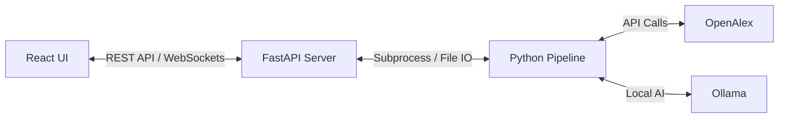

# Integration Plan: ResearchFlow Frontend & Backend

This plan outlines how to connect the React-based **ResearchFlow UI** with the **Python Research Pipeline** to create a fully functional, end-to-end research automation tool.

## 1. Architecture Overview

We will implement a **FastAPI** bridge that acts as the middleman between the web UI and the Python scripts.

## 2. Backend Implementation (FastAPI)

We will create a `server.py` in the root directory that manages the project state.

### Key API Endpoints
| Endpoint | Method | Purpose |
| :--- | :--- | :--- |
| `/api/config` | GET | Load settings from `research_config.py` |
| `/api/config` | POST | Update and save `research_config.py` |
| `/api/run/{stage}` | POST | Trigger a specific stage (e.g., `all-auto`, `phase3`) |
| `/api/logs` | WS | Stream real-time terminal output to the UI console |
| `/api/data/{type}` | GET | Return JSON data from CSVs (e.g., `topic_info.csv`) |
| `/api/figures` | GET | List and serve generated images from `FinalOutputs` |

### Task Management
Since research tasks can take several minutes (especially embeddings and clustering), we will use FastAPI's `BackgroundTasks` or a dedicated `subprocess` manager to run scripts without freezing the UI.

## 3. Frontend Integration (React)

### State Management
- **Pipeline Context**: A global state to track which stage is currently running and its progress percentage.
- **Config Store**: Handles the "Save/Reset" logic for the configuration forms.

### Real-time Logs
We will update the "Pipeline Output Console" in `Workflow.tsx` to listen to a WebSocket or Server-Sent Events (SSE) stream, allowing the user to see the Python traceback and progress bars (like tqdm) directly in the browser.

### Data Synchronization
- The **Data Explorer** will fetch live data from the `outputs/` directory instead of using the current mock data.
- The **Results** page will dynamically render figures as they are generated by the pipeline.

## 4. Proposed File Changes

### [NEW] `server.py`
A new FastAPI server file to handle all API requests.

### [MODIFY] `run_research_pipeline.py`
Small modifications to allow output to be captured and streamed to the API.

### [MODIFY] `ui/src/api/` [NEW DIR]
Create a service layer in React to handle all HTTP requests using `axios`.

## 5. Verification Plan

### Automated Tests
1. Verify that saving in the UI updates the physical `config.py` file.
2. Ensure clicking "Execute Stage" triggers the correct Python subprocess.
3. Test streaming of logs to ensure no "blocking" occurs during long-running tasks.

### Manual Verification
1. Run a full `all-auto` flow from the browser and verify that the "Dashboard" stats update in real-time.
2. Confirm that generated figures appear in the "Results" tab immediately after Phase 5 completes.

---

> [!IMPORTANT]
> This integration requires the user to have `fastapi` and `uvicorn` installed in their Python environment.

**Would you like me to proceed with building the `server.py` bridge based on this plan?**
